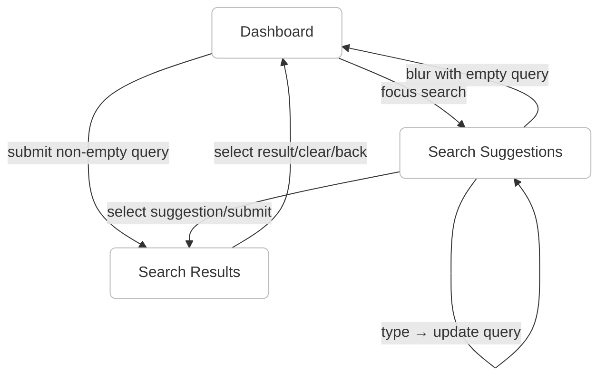

# Screen Architecture Refactoring Plan

## Current State Analysis

### Navigation Flow
- **Screen types (from `src/components/screen-manager/types.ts`)**:
  - `ScreenType.DASHBOARD` ('dashboard')
  - `ScreenType.SEARCH_SUGGESTIONS` ('search_suggestions')
  - `ScreenType.SEARCH_RESULTS` ('search_results')
- **State + navigation API (in `src/components/screen-manager/ScreenManagerContext.tsx`)**:
  - State shape: `{ currentScreen, previousScreen?, screenHistory, searchQuery? }`
  - Methods: `navigateTo(screen, searchQuery?)`, `navigateBack()`, `clearHistory()`
  - Transition animation flag: `isTransitioning`
- **Top-level integration (in `src/components/app-shell/MobileMapShell.tsx`)**:
  - Wraps everything in `ScreenManagerProvider` (initial: `DASHBOARD`)
  - Renders `BottomSheet` with sticky `SearchBar`, and `ScreenRenderer` as content
  - Controls bottom-sheet snap based on `currentScreen`
  - Controls `SearchBar` variant based on `currentScreen`
- **Screen rendering (in `src/components/screen-manager/ScreenRenderer.tsx`)**:
  - Switch by `currentScreen`:
    - `DASHBOARD`: renders `Dashboard` with `withinSheet=true` and hides search/quick access (since header is provided by sheet)
    - `SEARCH_SUGGESTIONS`: renders `SearchSuggestions` with `query`
    - `SEARCH_RESULTS`: renders `SearchResults` with `query`
  - Quick access shown above content when on `DASHBOARD`
- **Navigation points**:
  - `SearchBar` in `MobileMapShell` sticky header:
    - `onFocus` → `navigateTo(SEARCH_SUGGESTIONS, searchQuery)`
    - `onChange` (when on suggestions) → `navigateTo(SEARCH_SUGGESTIONS, value)`
    - `onSearch` (Enter/submit) with non-empty query → `navigateTo(SEARCH_RESULTS, query)`
    - `onClear` → `navigateTo(DASHBOARD)`
    - `onBlur` from suggestions with empty query → `navigateTo(DASHBOARD)`
  - `SearchSuggestions` → selecting a row calls back to `ScreenRenderer` which does `navigateTo(SEARCH_RESULTS, suggestion)`
  - `SearchResults` → selecting a result leads to `navigateTo(DASHBOARD)` (placeholder behavior)



### Component Inventory

- **Screen manager files (`src/components/screen-manager/`)**
  - `ScreenManagerContext.tsx` (provider, state, navigation API)
  - `ScreenRenderer.tsx` (switch to render screen)
  - `SearchSuggestions.tsx` (suggestions list)
  - `SearchResults.tsx` (results list)
  - `SuggestRow.tsx` (suggest item)
  - `types.ts` (enums and interfaces)
  - `index.ts` (exports)

- **Dashboard files (`src/components/dashboard/`)**
  - `Dashboard.tsx`
  - `SearchBar.tsx`
  - `QuickAccessPanel.tsx`
  - `StoriesPanel.tsx`
  - `StoryItem.tsx`
  - `advice/AdviceSection.tsx`
  - `advice/Cover.tsx`
  - `advice/Interesting.tsx`
  - `advice/MetaItem.tsx`
  - `advice/MetaItemAd.tsx`
  - `advice/RD.tsx`
  - `advice/primitives/AdviceBadge.tsx`
  - `advice/primitives/AdviceCardContainer.tsx`
  - `advice/primitives/AdviceCardText.tsx`
  - `advice/primitives/AdviceMedia.tsx`
  - `advice/index.ts`, `advice/types.ts`, `advice/mockData.ts`
  - `index.ts`

- **Bottom sheet files (`src/components/bottom-sheet/`)**
  - `BottomSheet.tsx`
  - `BottomSheet.types.ts`
  - `index.ts`
  - `bottom-sheet.css` (heavy overrides)

- **Top 50 component files snapshot (`src/components/`)**
```text
- app-shell/MobileMapShell.tsx
- bottom-sheet/BottomSheet.tsx
- bottom-sheet/BottomSheet.types.ts
- bottom-sheet/index.ts
- dashboard/Dashboard.tsx
- dashboard/QuickAccessPanel.tsx
- dashboard/SearchBar.tsx
- dashboard/StoriesPanel.tsx
- dashboard/StoryItem.tsx
- dashboard/advice/AdviceSection.tsx
- dashboard/advice/Cover.tsx
- dashboard/advice/Interesting.tsx
- dashboard/advice/MetaItem.tsx
- dashboard/advice/MetaItemAd.tsx
- dashboard/advice/RD.tsx
- dashboard/advice/index.ts
- dashboard/advice/mockData.ts
- dashboard/advice/primitives/AdviceBadge.tsx
- dashboard/advice/primitives/AdviceCardContainer.tsx
- dashboard/advice/primitives/AdviceCardText.tsx
- dashboard/advice/primitives/AdviceMedia.tsx
- dashboard/advice/types.ts
- dashboard/index.ts
- icons/Icon.tsx
- icons/index.ts
- map/MapContainer.tsx
- map/MapProvider.tsx
- screen-manager/ScreenManagerContext.tsx
- screen-manager/ScreenRenderer.tsx
- screen-manager/SearchResults.tsx
- screen-manager/SearchSuggestions.tsx
- screen-manager/SuggestRow.tsx
- screen-manager/index.ts
- screen-manager/types.ts
- search-results/SearchResultCard/SearchResultCard.tsx
- search-results/SearchResultCard/SearchResultCard.test.tsx
- search-results/SearchResultCard/SearchResultCard.types.ts
- search-results/SearchResultCard/components/ADSection.tsx
- search-results/SearchResultCard/components/DASection.tsx
- search-results/SearchResultCard/components/Friends.tsx
- search-results/SearchResultCard/components/Gallery.tsx
- search-results/SearchResultCard/components/HeaderNavBar.tsx
- search-results/SearchResultCard/components/SecondaryLine.tsx
- search-results/SearchResultCard/components/ZMKSection.tsx
- search-results/SearchResultCard/components/index.ts
- search-results/SearchResultCard/index.ts
```

### Screen Components and responsibilities
- `Dashboard`: Stories + Advice sections; optional header pieces depending on `withinSheet`.
- `SearchSuggestions`: suggestion source-of-truth for the list; uses `SuggestRow`.
- `SearchResults`: renders result cards list using `SearchResultCard`.
- `BottomSheet`: template container with sticky header for the search bar.
- `ScreenRenderer`: router-like switch deciding which screen to render.
- `MobileMapShell`: app shell that composes map + sheet + screen manager.

### Component Dependencies
- `MobileMapShell`
  - `ScreenManagerProvider` → provides navigation/state
  - `BottomSheet` → provides sticky `SearchBar`
  - `ScreenRenderer` → renders the active screen
  - `useMapGL` → adjusts map center on snap changes
- `ScreenRenderer`
  - `Dashboard` (within sheet mode)
  - `SearchSuggestions` (composed of `SuggestRow` + `Icon`)
  - `SearchResults` (composed of `SearchResultCard` and its subcomponents)
  - `QuickAccessPanel` (only when on dashboard)
- `Dashboard`
  - `SearchBar`, `QuickAccessPanel`, `StoriesPanel`, `AdviceSection`
- `SearchResultCard`
  - `components/*` (e.g., `Gallery`, `ADSection`, `DASection`, `Friends`, `WorkTime`, etc.)
- `BottomSheet`
  - `react-modal-sheet` primitives; owns hydration and drag behaviors; imports `bottom-sheet.css`

### Style Distribution
- Global: `src/app/globals.css` (Tailwind with CSS variables)
- Local stylesheet overrides: `src/components/bottom-sheet/bottom-sheet.css`
- Component-level: heavy use of Tailwind `className` + inline `style={{ ... }}`
- Repeated colors and resets: `#F1F1F1`, `border: 'none'`, `outline: 'none'`

## Problems Identified

### Ambiguity Issues
- Dual source of truth for `searchQuery`: local state in `MobileMapShell` and `screenState.searchQuery` in `ScreenManagerContext`.
- Mixed responsibility between `ScreenRenderer` and `Dashboard` for showing quick access and search header.
- Screen naming inconsistency (`search_suggestions`, `search_results`) vs desired simpler constants.
- Navigation side-effects live in multiple places (`ScreenRenderer`, `MobileMapShell`, `SearchBar`), making flows harder to track.

### Code Duplication
- Inline styles repeated across multiple components (`border: 'none'`, `outline: 'none'`, repeated `#F1F1F1` background logic).
- Similar layout paddings/margins repeated in `SearchResults` wrappers and card containers.
- Quick access rendering present in `Dashboard` and mirrored wrapper in `ScreenRenderer`.

### Unnecessary Complexity
- `BottomSheet` SSR/hydration placeholders and numerous CSS overrides may be simplified if we accept design degradations.
- Excessive CSS reset rules in `bottom-sheet.css` duplicate inline resets.
- Transition state `isTransitioning` adds opacity/translate effects that might be optional initially.

## Proposed Atomic Design Structure

### Atoms (Basic building blocks)
- Button
- Icon
- Input
- Badge/Chip
- Avatar/Image
- Divider
- CardContainer (surface with padding/radius)
- DragHandle
- Spacing/Stack primitives

### Molecules (Simple combinations)
- SearchInput (Icon + Input + Clear/Voice)
- SuggestRow (Icon + Text + Distance/BranchCount)
- QuickAction (Icon + Label)
- StoryItem (Avatar + Label)
- AdviceCard (Media + Text + Meta)
- Rating/Distance pill

### Organisms (Complex components)
- SearchBar (SearchInput + Menu/Clear)
- QuickAccessPanel (QuickAction list)
- StoriesPanel (StoryItem list)
- AdviceSection (AdviceCard grid)
- SearchResultsList (Card list)
- SearchSuggestionsList (SuggestRow list)

### Templates (Page layouts)
- BottomSheetLayout (sticky header + scrollable content)
- MobileMapTemplate (Map + BottomSheetLayout)
- ScreenManager (single routing/transition surface)

### Pages (Screens)
- DashboardScreen
- SearchSuggestionsScreen
- SearchResultsScreen

## Refactoring Steps

### Phase 1: Simplify Navigation (Priority: HIGH)
1. Consolidate all navigation logic into single `ScreenManager` layer.
2. Remove duplicate search state from `MobileMapShell` and rely solely on `screenState.searchQuery`.
3. Create clear screen name constants.
4. Implementation:
   - [ ] Merge/centralize navigation handlers in `src/components/screen-manager` (expose a typed `navigate` API)
   - [ ] Remove ambiguous screen names; adopt concise constants for display (keep enum values for compatibility during migration)
   - [ ] Create `SCREENS` enum (string constants) and map to existing `ScreenType`
   - [ ] Route all `SearchBar` interactions through a single adapter in `ScreenManager`

### Phase 2: Extract Atomic Components (Priority: HIGH)
1. Create `src/components/atoms/` directory; `src/components/molecules/`; `src/components/organisms/`.
2. Extract reusable atoms/molecules from existing components.
3. Implementation:
   - [ ] Extract `Button` atom from button instances in `SearchBar`, `SuggestRow`, `SearchResultCard`
   - [ ] Extract `Input` atom from `SearchBar`
   - [ ] Extract `CardContainer` atom from `SearchResultCard` wrappers
   - [ ] Move `SuggestRow` to `molecules/`
   - [ ] Move `SearchResultCard` to `organisms/` and split its subcomponents into molecules/atoms where applicable

### Phase 3: Consolidate Styles (Priority: MEDIUM)
1. Reduce reliance on `bottom-sheet.css` by moving minimal needed rules inline or to Tailwind utilities.
2. Centralize visual tokens in constants (COLORS, SPACING) and/or Tailwind theme.
3. Implementation:
   - [ ] Create `src/lib/ui/tokens.ts` exporting `COLORS`, `SPACING`, `RADIUS`
   - [ ] Replace hard-coded `#F1F1F1` and repeated `border: 'none'`/`outline: 'none'` with semantic tokens/utilities
   - [ ] Trim `bottom-sheet.css` to only the critical overrides; prefer Tailwind classes

### Phase 4: Remove Complexity (Priority: HIGH)
1. Remove optional transitions and animations initially for clarity.
2. Flatten component hierarchy where possible.
3. Accept design degradations for simplicity:
   - [ ] Remove complex animation toggles using `isTransitioning`
   - [ ] Simplify gray header/background toggling to a single place (template)
   - [ ] Prefer standard elements and Tailwind utilities over custom CSS resets

## Code to Remove
- [ ] Redundant inline style resets (`border: 'none'`, `outline: 'none'`) where not needed
- [ ] Duplicate rendering of quick access in both `Dashboard` and `ScreenRenderer` (pick one place)
- [ ] Excess rules in `src/components/bottom-sheet/bottom-sheet.css` after consolidation

## Migration Guide
- **Screens**
  - Current: `src/components/screen-manager/*` → New: `src/components/pages/*`
  - `ScreenRenderer` → `templates/ScreenManager.tsx`
  - `SearchSuggestions` → `organisms/SearchSuggestionsList.tsx`
  - `SearchResults` → `organisms/SearchResultsList.tsx`
- **Components**
  - `SearchBar` → `molecules/SearchBar.tsx` (with `atoms/Input`, `atoms/Button`)
  - `SuggestRow` → `molecules/SuggestRow.tsx`
  - `SearchResultCard` → `organisms/SearchResultCard` (subparts to molecules/atoms)
- **Styles**
  - Move repeated inline constants to `src/lib/ui/tokens.ts` and Tailwind theme
  - Minimize `bottom-sheet.css` usage

## New Navigation Architecture

### Screen Names (Constants)
```typescript
export enum SCREENS {
  DASHBOARD = 'dashboard',
  SUGGESTIONS = 'suggestions',
  RESULTS = 'results',
}
```

- Temporary mapping layer for migration:
```typescript
const ScreenTypeToSCREENS: Record<import('@/components/screen-manager').ScreenType, SCREENS> = {
  dashboard: SCREENS.DASHBOARD,
  search_suggestions: SCREENS.SUGGESTIONS,
  search_results: SCREENS.RESULTS,
};
```

### Navigation Flow
- Dashboard → focus search → Suggestions
- Suggestions → select/submit → Results
- Suggestions → blur empty or Clear → Dashboard
- Results → select result or Clear → Dashboard

### Where to Make Changes
| Feature | File Location | Component Name |
|---------|---------------|----------------|
| Search bar styling | `src/components/dashboard/SearchBar.tsx` → move to `molecules/SearchBar.tsx` | `SearchBar` |
| Suggestion items | `src/components/screen-manager/SuggestRow.tsx` → move to `molecules/SuggestRow.tsx` | `SuggestRow` |
| Navigation logic | `src/components/screen-manager/ScreenRenderer.tsx` + `MobileMapShell.tsx` → consolidate to `templates/ScreenManager.tsx` | `ScreenManager` |
| Bottom sheet layout | `src/components/bottom-sheet/BottomSheet.tsx` | `BottomSheet` |
| Quick access panel | `src/components/dashboard/QuickAccessPanel.tsx` | `QuickAccessPanel` |
| Search results list | `src/components/screen-manager/SearchResults.tsx` → `organisms/SearchResultsList.tsx` | `SearchResultsList` |
| Result card | `src/components/search-results/SearchResultCard/*` | `SearchResultCard` |

## Implementation Checklist

### Immediate Actions (Can do now)
- [ ] Document all existing screens in this file
- [ ] Create component dependency graph (update as you move things)
- [ ] Identify and list all duplicate code (inline styles, background constants)
- [ ] Mark components for deletion or consolidation

### Refactoring Actions (Ordered)
1. [ ] Create atomic folder structure (atoms, molecules, organisms, templates, pages)
2. [ ] Extract first atom (`Button`, `Input`)
3. [ ] Update `SearchBar` to use atoms
4. [ ] Move `SuggestRow` to molecules; update imports
5. [ ] Move `SearchResultCard` to organisms; split subparts
6. [ ] Replace hard-coded colors/margins with tokens
7. [ ] Consolidate navigation inside a new `templates/ScreenManager.tsx`
8. [ ] Remove duplicate quick access rendering location
9. [ ] Trim `bottom-sheet.css`
10. [ ] Delete unused styles/utilities

### Testing Strategy
- Keep existing tests running; update import paths as files move
- Add unit tests for `ScreenManager` navigation transitions
- Add smoke tests for each page/screen after migration
